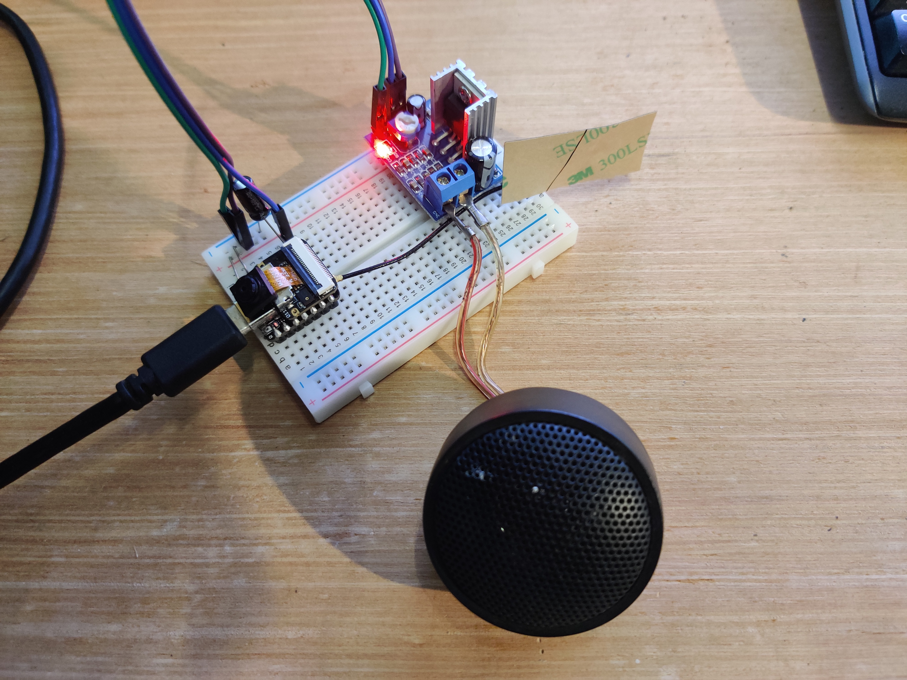

# ESP32 Text-to-Speech (PicoTTS) with XIAO ESP32-S3

This project demonstrates how to implement PicoTTS system on an XIAO ESP32-S3 device using the PicoTTS engine.

Output is implemented as I2S PDM which means no hardware codec is required, just analogue amplification and filters (not strictly necessary).

## Running

Easiest way to run is to have Nix installed. Then run (in this directory):

    nix develop

    ./run.sh

Wire a transistor/amplifier to GPIO44 and enjoy slightly noisy TTS output! :-)

